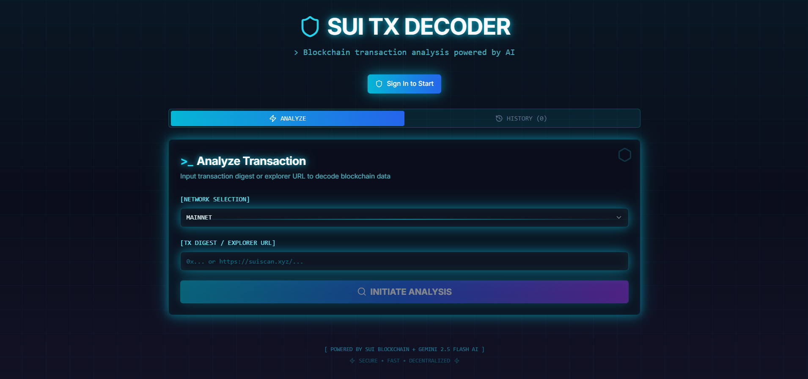
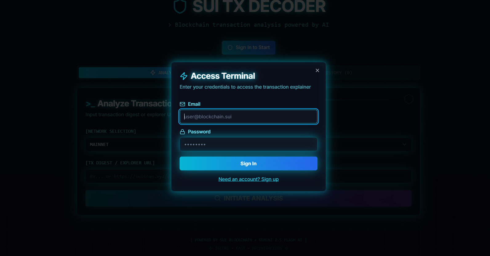
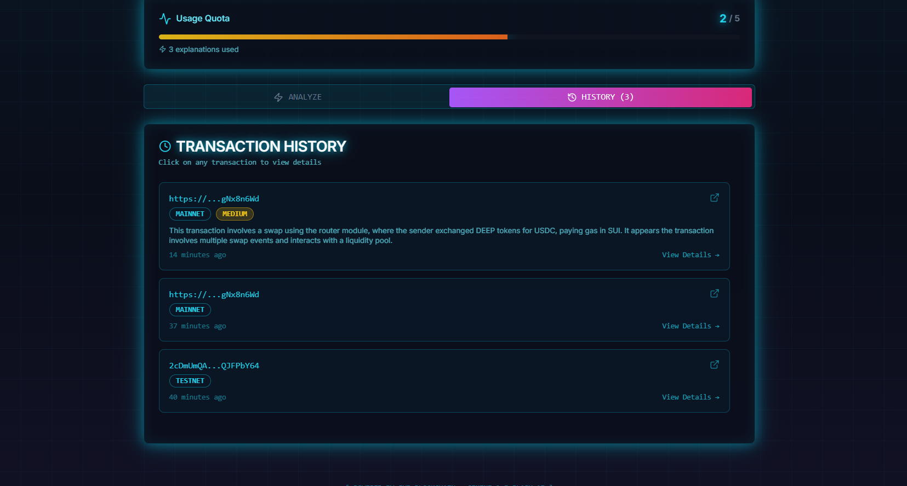
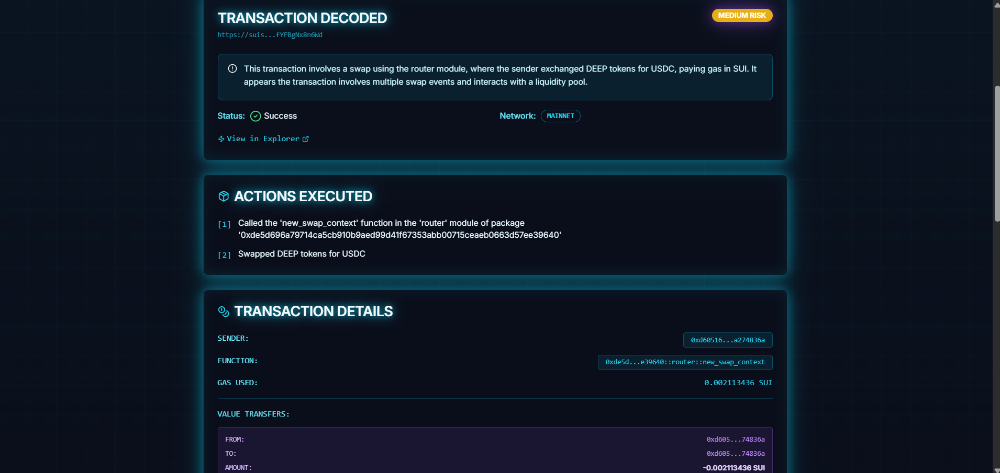
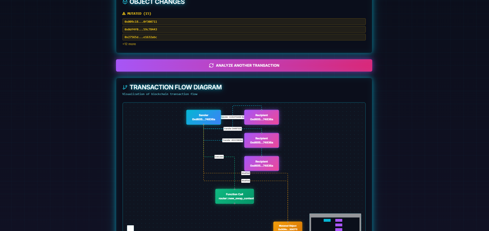

# Sui Transaction Explainer

A production-ready Next.js application that explains Sui blockchain transactions in plain language using AI. Simply paste a transaction digest or Sui Explorer URL, and get an instant, human-readable explanation powered by Google's Gemini 2.5 Flash.
App Link: https://sui-transaction-explainer-dusky.vercel.app/

## Features

- **Plain Language Explanations**: Converts complex blockchain transactions into easy-to-understand summaries
- **Multi-Network Support**: Switch between Sui Mainnet and Testnet
- **Transaction Parsing**: Automatically extracts digests from Sui Explorer URLs
- **AI-Powered Analysis**: Uses Gemini 2.5 Flash to provide risk assessment, action summaries, and detailed breakdowns
- **Visual Flow Representation**: Simple visualization showing sender, recipients, and value transfers
- **Comprehensive Details**: Shows gas costs, Move function calls, object changes, and balance transfers
- **Rate Limiting**: Built-in protection against API abuse
- **Responsive Design**: Works seamlessly on desktop and mobile devices
- **Error Handling**: Clear, user-friendly error messages for all edge cases

## Screenshots

### 1. Landing Page


### 2. Authentication with Supabase


### 3. History


### 4. Transaction Explainer


### 5. Diagram Visualization



## Architecture

### Tech Stack

- **Framework**: Next.js 13 (App Router) with TypeScript
- **UI**: Tailwind CSS + shadcn/ui components
- **Blockchain**: Sui TypeScript SDK (@mysten/sui)
- **AI**: Google Generative AI (@google/generative-ai)
- **State Management**: React hooks
- **Styling**: Tailwind CSS with custom design system

### Project Structure

```
sui-transaction-explainer/
├── app/
│   ├── _components/
│   │   ├── transaction-form.tsx      # Input form for digest/URL
│   │   ├── transaction-result.tsx    # Display transaction details
│   │   └── transaction-viz.tsx       # Visual flow representation
│   ├── api/
│   │   └── explain/
│   │       └── route.ts              # Server API endpoint
│   ├── layout.tsx                     # Root layout
│   ├── page.tsx                       # Main page
│   └── globals.css                    # Global styles
├── lib/
│   ├── sui.ts                         # Sui client & utilities
│   ├── ai.ts                          # Gemini AI client
│   ├── parse.ts                       # Transaction parsing logic
│   ├── rate-limiter.ts               # Rate limiting implementation
│   └── utils.ts                       # Common utilities
└── components/ui/                     # shadcn/ui components
```

### Data Flow

1. **User Input**: User enters transaction digest or Explorer URL
2. **Normalization**: Extract digest from URL if needed
3. **Blockchain Fetch**: Query Sui RPC via @mysten/sui SDK
4. **Parsing**: Extract key facts (sender, recipients, gas, objects, calls)
5. **AI Analysis**: Send to Gemini 2.5 Flash for natural language explanation
6. **Display**: Show results with facts, AI summary, and visualization

## Getting Started

### Prerequisites

- Node.js 18+ installed
- A Google AI Studio API key (Gemini)
- Internet connection (for Sui RPC and AI API)

### Installation

1. Clone the repository:
```bash
git clone <repository-url>
cd sui-transaction-explainer
```

2. Install dependencies:
```bash
npm install
```

3. Set up environment variables:

Create a `.env.local` file in the root directory:

```env
GEMINI_API_KEY=your_gemini_api_key_here
SUI_DEFAULT_NETWORK=mainnet
```

**Getting a Gemini API Key:**
- Visit [Google AI Studio](https://aistudio.google.com/app/apikey)
- Sign in with your Google account
- Click "Create API Key"
- Copy and paste into your `.env.local` file

4. Run the development server:
```bash
npm run dev
```

5. Open [http://localhost:3000](http://localhost:3000) in your browser

### Scripts

- `npm run dev` - Start development server
- `npm run build` - Build for production
- `npm start` - Start production server
- `npm run lint` - Run ESLint
- `npm run typecheck` - Run TypeScript type checking

## Usage

### Basic Usage

1. **Select Network**: Choose between Mainnet or Testnet
2. **Enter Transaction**: Paste either:
   - A transaction digest (hash)
   - A full Sui Explorer URL (suiscan.xyz, suivision.xyz, or explorer.sui.io)
3. **Click Explain**: Wait for the analysis
4. **View Results**: Review the summary, details, and visualization
5. **Explain Another**: Click the button to analyze a new transaction

### Supported URL Formats

The app automatically extracts digests from these Explorer URLs:
- `https://suiscan.xyz/mainnet/tx/[DIGEST]`
- `https://suivision.xyz/testnet/tx/[DIGEST]`
- `https://explorer.sui.io/tx/[DIGEST]`

### Example Transactions

**Mainnet Example:**
```
https://suiscan.xyz/mainnet/tx/J9Zu5tz6gNhCdm5p9fJ1KqQYW8E7mRxH2vT4kL3sN8wP
```

**Testnet Example:**
```
https://suiscan.xyz/testnet/tx/A1Bc2De3Fg4Hi5Jk6Lm7Np8Qr9St0Uv1Wx2Yz3Ab4Cd5
```

## Data Sources

### Sui RPC

The app uses Sui's official JSON-RPC API via the `@mysten/sui` SDK:
- **Mainnet**: `https://fullnode.mainnet.sui.io:443`
- **Testnet**: `https://fullnode.testnet.sui.io:443`

Data fetched includes:
- Transaction details and status
- Gas costs (computation + storage - rebate)
- Balance changes (who received/sent what)
- Object changes (created, mutated, deleted)
- Move call details (package, module, function)
- Events emitted by the transaction

### Gemini 2.5 Flash

Google's Gemini 2.5 Flash model analyzes the raw transaction data and provides:
- **Risk Assessment**: Low, medium, or high based on transaction patterns
- **Plain Language Summary**: What the transaction actually does
- **Action List**: Key actions taken in simple terms
- **Transfer Details**: Who sent what to whom
- **Object Information**: Created, modified, or deleted objects

## Gas Calculation

Sui gas costs are calculated as:
```
Total Gas = Computation Cost + Storage Cost - Storage Rebate
```

The app formats gas amounts with 9 decimal places (SUI's native precision) and displays them in human-readable format (e.g., "0.001234567 SUI").

## Rate Limiting

To prevent API abuse, the app implements IP-based rate limiting:
- **Window**: 60 seconds
- **Max Requests**: 10 per window
- **Response**: HTTP 429 with reset time when limit exceeded

Rate limit headers included in responses:
- `X-RateLimit-Remaining`: Requests remaining in current window
- `X-RateLimit-Reset`: Unix timestamp when limit resets

## Security & Privacy

### Best Practices

- API keys stored server-side only (never exposed to client)
- All AI calls happen on the server via API routes
- No transaction data is stored or logged
- No user authentication required (public read-only data)
- Rate limiting prevents abuse

### Environment Variables

**Never commit these to version control:**
- `GEMINI_API_KEY` - Server-only, not prefixed with `NEXT_PUBLIC_`

**Safe to expose (if needed):**
- `NEXT_PUBLIC_*` variables are public but not needed for this app

## Error Handling

The app gracefully handles common errors:

| Error | Message | Action |
|-------|---------|--------|
| Invalid digest | "Invalid transaction digest format" | Check format |
| Transaction not found | "Transaction not found..." | Verify network & digest |
| Rate limit exceeded | "Rate limit exceeded..." | Wait and retry |
| Network error | "An unexpected error occurred..." | Check connection |
| Invalid API key | Returns 500 | Check GEMINI_API_KEY |

## Deployment

### Vercel (Recommended)

1. Push code to GitHub
2. Import project in Vercel
3. Add environment variables:
   - `GEMINI_API_KEY`
   - `SUI_DEFAULT_NETWORK` (optional, defaults to mainnet)
4. Deploy

### Other Platforms

The app works on any platform supporting Next.js 13+:
- Netlify
- Railway
- AWS Amplify
- Google Cloud Run
- Self-hosted with Node.js

## Limitations

### Current Limitations

- **Language**: English-only explanations (AI model limitation)
- **Visualization**: Simple flow diagram (no complex multi-hop visualization)
- **Package Labels**: Shows package IDs, not human-readable names
- **Transaction History**: No caching or history (stateless)
- **Batch Processing**: One transaction at a time
- **Complex Transactions**: Very large transactions may be truncated

### Known Issues

- Some Move call details may be simplified for readability
- Object IDs are truncated for display (full IDs in hover/tooltip could be added)
- No support for sponsored transactions details (shows only sender)

## Future Enhancements

Potential improvements for future versions:

1. **Multi-Language Support**: Explanations in multiple languages
2. **Transaction History**: Save and compare previous analyses
3. **Advanced Visualization**: Interactive flow diagrams with zoom/pan
4. **Package Registry**: Show human-readable package names
5. **Batch Analysis**: Analyze multiple transactions at once
6. **Export Options**: Download reports as PDF or CSV
7. **Notifications**: Watch addresses and get alerts
8. **Cost Estimation**: Predict gas costs before sending transactions
9. **Simulation**: Test transactions before executing
10. **Developer Mode**: Raw JSON view for technical users

## Contributing

Contributions are welcome! Please follow these guidelines:

1. Fork the repository
2. Create a feature branch
3. Make your changes with tests
4. Ensure `npm run build` succeeds
5. Submit a pull request

## License

MIT License - feel free to use this project for any purpose.

## Acknowledgments

- **Mysten Labs** - Sui blockchain and TypeScript SDK
- **Google** - Gemini AI model
- **Vercel** - Next.js framework
- **shadcn** - Beautiful UI components

## Support

For issues, questions, or suggestions:
- Open an issue on GitHub
- Check existing issues for solutions
- Review the documentation above

## Disclaimer

**Important:** This tool is for informational purposes only. While we strive for accuracy:

- AI explanations may contain errors or simplifications
- Always verify critical information with blockchain explorers
- Not financial, legal, or investment advice
- Use at your own risk
- No warranties or guarantees provided

Transaction data is fetched directly from Sui's public RPC nodes. The AI analysis is generated by Google's Gemini model and may not be 100% accurate in all cases.

---

Built by Tihoc Andrei for the Sui community
